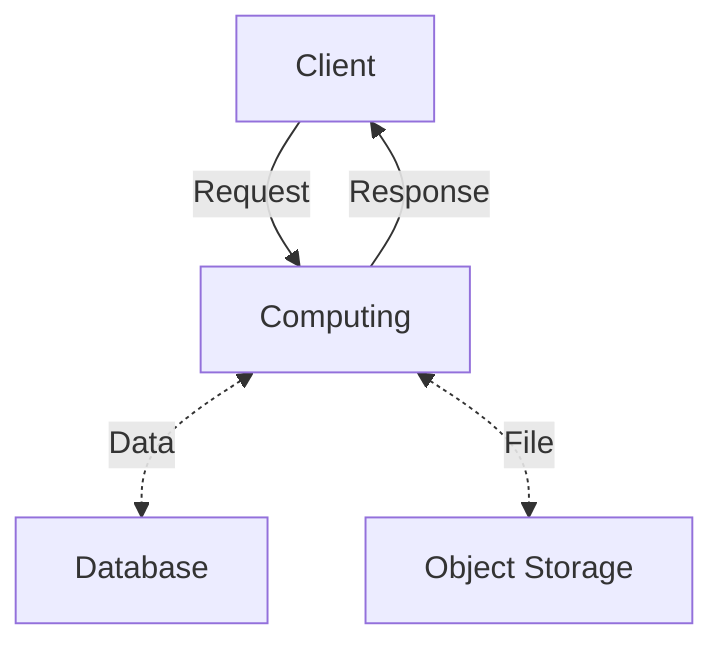

# 師大資工營報名系統

即刻前往 <https://camp-app.csie.cool/> 進行報名！

## Technical Details

This section is for beginner developers interested in the technical aspects of this project.

### Web Dev Terminology

Here are some essential web development concepts that newcomers should understand before collaborating with the dev team. I have organized these terminologies into three categories: Framework, Infrastructure, and Utilities.

#### Framework

- **JS-HTML framework**: Often referred to as a front-end framework, this **binds JavaScript logic with HTML.** We use **Svelte** in this project.
- **Meta-framework**: A full-stack framework that is usually built on top of a front-end framework, typically providing **server-side rendering** and routing. We use **SvelteKit** in this project.
- **Style framework**: Provides predefined classes for styling and is used to create UI components. In this project, we use **TailwindCSS**, an atomic CSS framework that offers a set of **utility classes**, like `p-4` for padding and `text-green-400` for coloring. Additionally, we use some **pre-designed components** (like `card`, `drawer`, etc.) from **DaisyUI**, a plugin for TailwindCSS.

Here is a simple todo-list comparison with and without a JS-HTML framework:

Without JS-HTML framework:

```html
<div>
    <input type="text" id="newTask">
    <button onclick="addTask()">Add Task</button>
</div>
<ul id="taskList"></ul>

<script>
    function addTask() {
        const taskText = document.getElementById('newTask').value;
        if (taskText) {
            const li = document.createElement('li');
            li.textContent = taskText;
            li.onclick = function(event) {
                const comment = prompt("Enter comment for this task:");
                if (comment) {
                    this.textContent = `${taskText} - ${comment}`;
                }
            }
            li.oncontextmenu = function(event) {
                event.preventDefault();
                this.parentNode.removeChild(this);
            }
            document.getElementById('taskList').appendChild(li);
            document.getElementById('newTask').value = '';
        }
    }
</script>
```

With JS-HTML framework (Svelte):

```html
<script>
    let tasks = [];
    let newTask = '';

    function addTask() {
        if (newTask) {
            tasks = [...tasks, { text: newTask, comment: '' }];
            newTask = '';
        }
    }

    function addComment(index) {
        const comment = prompt("Enter comment for this task:");
        if (comment) {
            tasks[index].comment = comment;
            tasks = tasks; // to trigger reactivity
        }
    }

    function deleteTask(index, event) {
        tasks.splice(index, 1);
        tasks = tasks; // to trigger reactivity
    }
</script>

<div>
    <input bind:value={newTask}>
    <button on:click={addTask}>Add Task</button>
</div>

<ul>
    {#each tasks as task, index}
        <li on:click={() => addComment(index)} on:contextmenu|preventDefault={() => deleteTask(index)}>
            {task.text} {task.comment ? `- ${task.comment}` : ''}
        </li>
    {/each}
</ul>
```

As you can see, the Svelte version decouples the **data logic** from **DOM manipulation**, with the **DOM manipulation** being **reactively** handled by the framework.

#### Infrastructure

- **Server Computing**: As we have some sensitive operations that cannot be done on the client side (e.g., password comparison), server computing is required. We use **Cloudflare Pages** with Function (Cloudflare Workers) as the cloud computing platform in production. During local development, the SvelteKit dev server acts in the same role.
- **Database**: Tabular user data are stored in a SQL database. In production, we use **Cloudflare D1** as a cloud database service. Locally, we use SQLite.
- **Object Storage**: Binary data, e.g., user avatars and portraits, are stored in **Cloudflare R2** in production. Locally, we use the file system.

Here is a simple diagram of how the system works:



#### Utilities

- **Authentication**: JSON Web Tokens (JWT) are used for secure user identification.
- **Data Validation**: Zod is used to ensure data integrity and format consistency.
- **Error Tracking**: Sentry is employed to monitor and report errors.
- **Email Delivery**: Hermes is used for sending emails to users.
- **Icon Library**: Iconify is used to provide a set of icons for the UI.

### Core Concepts

- **Data Integrity**: Data must be validated when crossing boundaries of the API and database.
- **Error Observability**: Unexpected errors must not be exposed to the end user and must be recorded into the logging system, signaling to the dev team if possible.
- **Access Permission**: Permission checks should be performed for every request.
- **Reactivity**: The UI should have visual feedback for user interactions (e.g., hover, click, etc.) and state changes (e.g., disable the button when submitting a form, re-enable it when the submission is done or failed).

> This app still has considerable room for improvement. Best practices and patterns are not always followed, and some parts of the codebase are disorganized, as they were hastily put together by someone rushing to meet the deadline!
